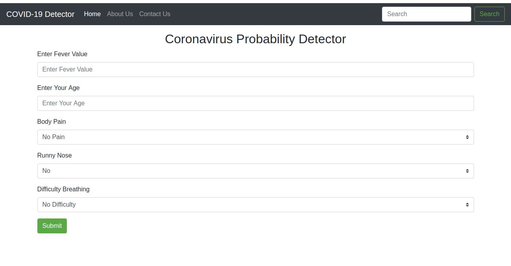
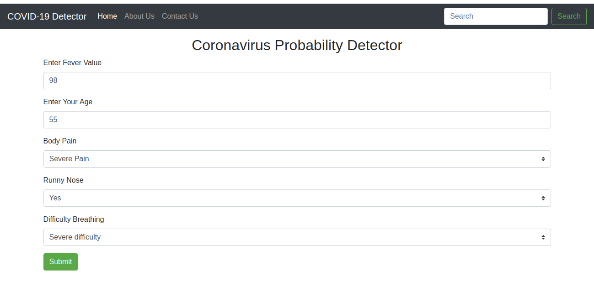
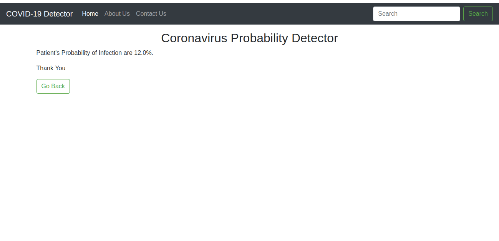

# CoronaDetector
This is a Corona detector website which analyses data given by user against randomly generated data and predicts whether the user is infected or not
To run type in the terminal go to the folder :
 /usr/bin/python3 /{path where the file is stored}/Corona/main.py
Example:
 /usr/bin/python3 /home/dell/Desktop/Corona/main.py

Working Preview:

